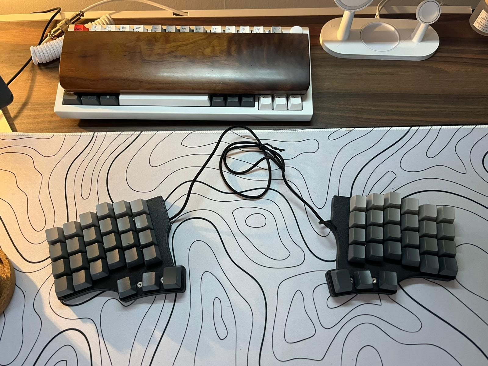

# Notes from a commissioned project
The following content are from my personal notes as from what I learned from doing a commissioned split-keeb, I hope someone might find it useful as to avoid the same pits I stepped into.

## Proper column and row wiring
With the cost of the overall thickness of the board, it will be worth adding 1-2mm in height of the volume inside of the case, so it can accommodate 16-18 awg solid wire for the matrix.
Alternatively use of low-profile switches might suffice if the requirement of a total height of 11mm is desired.

## Support for hot plugging
I so wish I learnt this before the rev. 1, but TRRS is not hot-pluggable, and hot-plugging will result in shorting the controller.
For the rev. 2, USB-C will be used for communications between the two halves.

## Tight thumbcluster
Moving the 3-piece thumbcluster 1u to the inner-edge of each halves seems more comfortable and gives better flexibility for the thumb.

## No visible screws on the plate
As the title says, the screws that are m3 right now, gets in the way of the switches and interferes with the clamping force of nearby switches, so removing the screws from the plate is essential, and instead adding m2x4x3.5 heated inserts on the back of the plate and screwing in from the back will be better

## Better option for tenting and anti-slip
The tenting right now is not that good, need to brainstorm how to make it better.

## 2.7mm led-strip?
Just to mark down the idea of having a user-facing led-strip, so it can look nice when not in use and can be used as a "Do not Disturb"-indicator for office-environments

## Hot-swap sockets
Yup, would be nice as the customer replaced the switches. (Although this worked out with guidance thru whatsapp)

## Turn the mcu upside down 
As well as holes in the bottom-case to allow easier access to RESET and BOOT-btns